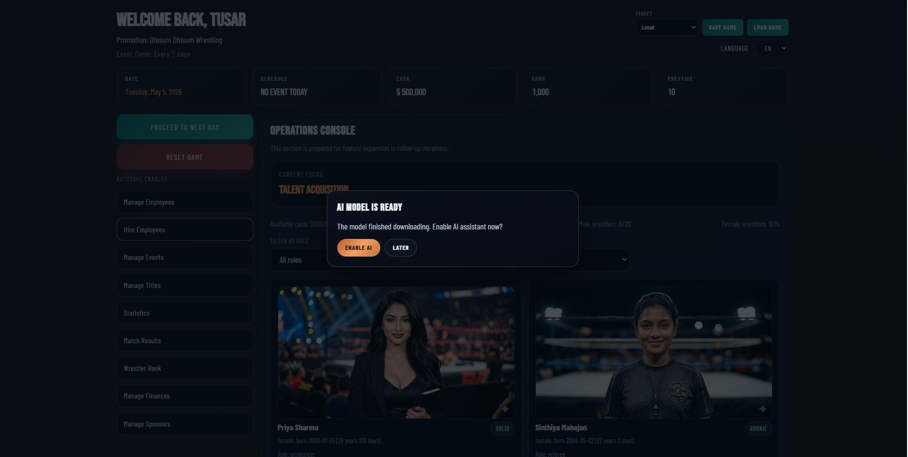
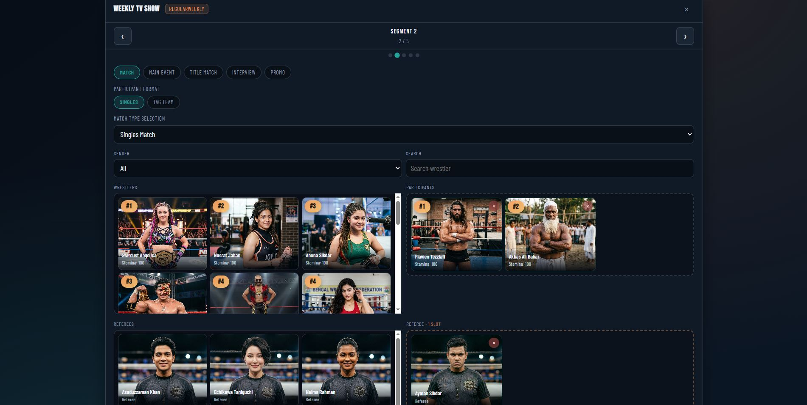
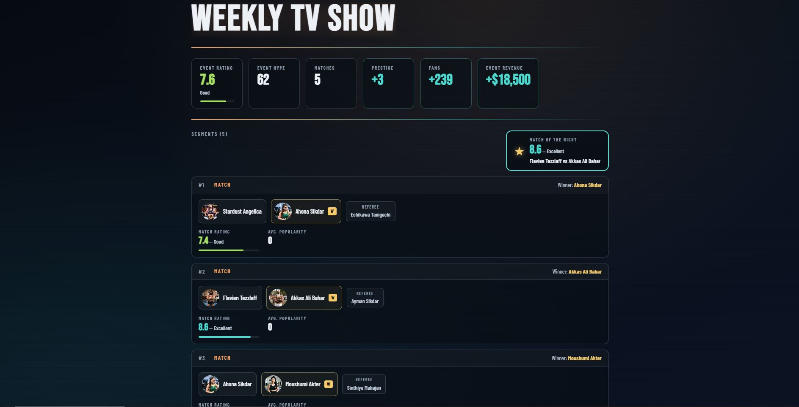
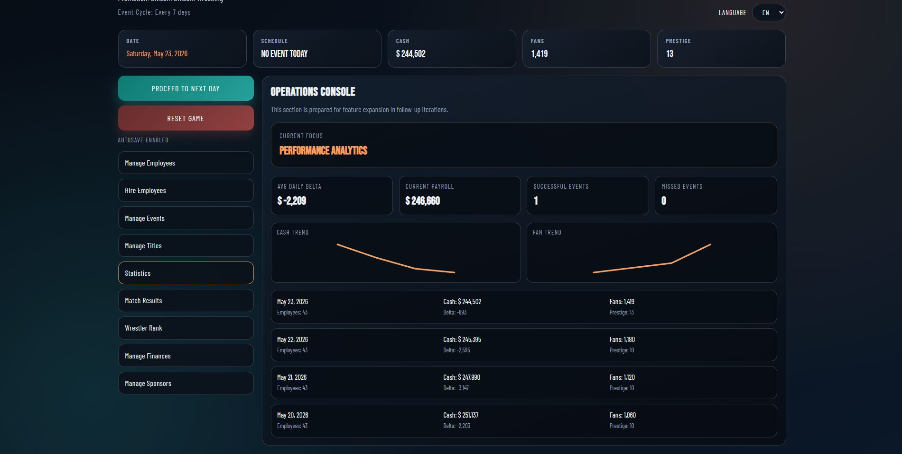
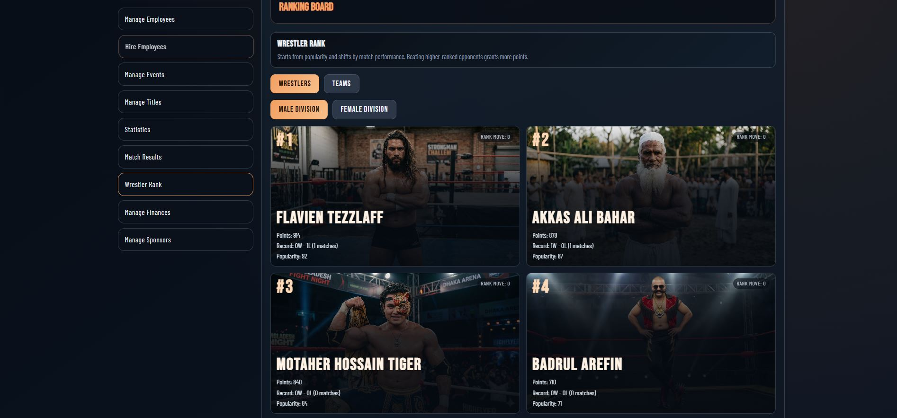
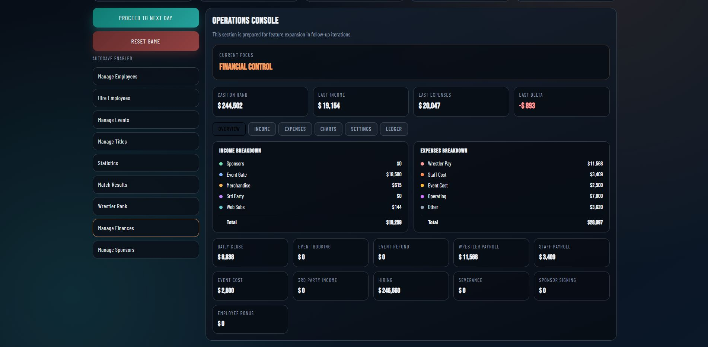
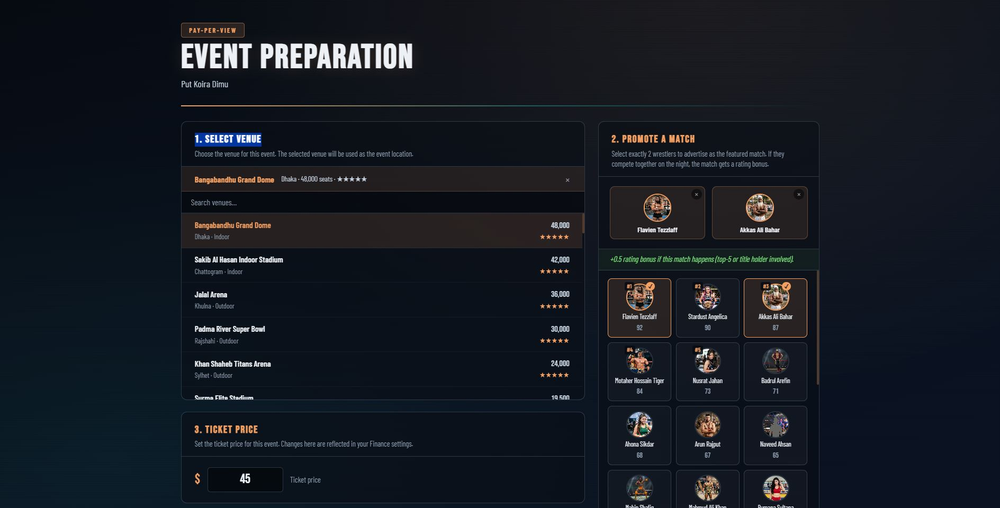

# 🎭 Wrestling Tycoon

**Build your wrestling empire from the ground up!**

Wrestling Tycoon is a comprehensive sports management simulation game where you become the owner and operator of a wrestling company. Start with limited resources and grow your organization into a powerhouse by hiring talented wrestlers, booking matches, managing finances, and building your company's prestige and reputation.



---

## 📋 Table of Contents

- [Features](#-features)
- [Game Overview](#-game-overview)
- [Core Gameplay Systems](#-core-gameplay-systems)
- [Getting Started](#-getting-started)
- [Project Structure](#-project-structure)
- [Technologies](#-technologies-used)
- [Gameplay Guide](#-gameplay-guide)
- [System Documentation](#-system-documentation)

---

## ✨ Features

- **Dynamic Company Management**: Build and manage your wrestling organization from scratch
- **Roster Management**: Hire, train, and manage wrestlers and staff with unique attributes
- **Event Creation**: Design custom wrestling events with various match types and segments
- **Financial System**: Track income, expenses, and cash flow throughout your company's growth
- **Prestige System**: Build your company's reputation through successful events and elite roster management
- **AI Integration**: AI-powered interview and promo system for authentic wrestling content
- **Ranking System**: Dynamic wrestler ranking based on match performance and popularity
- **Happiness & Morale**: Manage employee satisfaction and team morale
- **Multi-language Support**: Game available in multiple languages via i18n
- **Save/Load System**: Persistent game saves with cloud integration via Firebase

---

## 🎮 Game Overview

### Starting Position
- **Initial Cash**: $500,000
- **Starting Fans**: 1,000
- **Initial Prestige**: 10
- **Event Cycle**: 7 days between major events

### Your Objectives

1. **Grow Your Fan Base**: Attract more fans through successful events and roster quality
2. **Build Prestige**: Establish your company as a major wrestling promotion
3. **Manage Finances**: Balance income and expenses to maintain profitability
4. **Develop Talent**: Hire wrestlers, manage their happiness, and build a championship roster
5. **Create Content**: Book engaging events with compelling match cards



---

## 🎯 Core Gameplay Systems

### 1. Financial System

Your company's lifeblood—manage cash carefully to survive and thrive.

#### Income Sources
- **Base Income**: $18,000 + 8% of current fan base daily
- **Sponsor Payouts**: Daily recurring revenue from active sponsorships
- **Event Revenue**: Gate receipts based on event type, hype, and attendance

#### Expenses
- **Payroll**: Employee salaries divided across 30 days
- **Staffing Costs**: $5,500 base + payroll costs
- **Operating Costs**: $3,000 daily operating expenses
- **Event Expenses**: Setup costs ($2,200 + production scale × $1,700 + risk × $60)
- **Match Payouts**: Per-match fees for wrestler appearances
- **Severance**: 50% of employee salary when firing

#### Key Mechanics
- Daily timeline cash updates compute income and expenses automatically
- Event booking requires upfront setup costs
- Deleting future events refunds 60% of setup costs
- All transactions tracked in ledger (last 120 entries)

**See**: [docs/FINANCE_MONEY_SYSTEM.md](docs/FINANCE_MONEY_SYSTEM.md) for detailed calculations

### 2. Prestige System

Your company's reputation in the wrestling world—starts at 10 with no upper limit.

#### What Affects Prestige

**Event Performance** (Primary Driver)
- High-quality matches: Good match ratings (+0.4 per point above 5)
- Popular roster: Up to +2 prestige per event from wrestler popularity
- Event type bonuses:
  - Match segment: +1
  - Main event: +4
  - Title match: +3
  - Promo: +1
  - Interview: 0

**Elite Roster**
- Hiring wrestler with skill ≥ 82: +1 to +7 prestige (scales with skill)
- Firing elite wrestler: -1 to -7 prestige (inverse of hire bonus)

**Event Skipping**
- Penalty: -5% to -10% of current prestige (minimum -1)
- No income earned for skipped events

#### Prestige Formula
```
prestigeDelta = round(
    hype / 36 - risk / 42 + segmentBonus
    + (avgWrestlerPopularity / 100) × 2
    + matchRatingBonus
)
```

**See**: [docs/prestige.md](docs/prestige.md) for detailed formulas



### 3. Happiness & Morale System

Keep your employees happy and productive.

#### Who Has Happiness
- **Wrestlers**: Tracked with happiness values (default: 50)
- **Staff**: Tracked with happiness values (default: 50)
- **Range**: Clamped between 0-100

#### Happiness Modifiers

**Match Outcomes (Wrestlers)**
- Win vs 1 opponent: +1
- Win vs multiple: +1 per opponent
- Loss vs 1 opponent: -2
- Loss vs multiple: -1

**Title Changes**
- Winning a title: +10 per title

**Inactivity**
- No matches for 30 days: -3 (once per 30-day period)

#### Critical Events
- **Termination**: Happiness reaches 0 → Employee leaves automatically
- **Rehire Lock**: Terminated employees locked from hiring for 90 days
- **Low Happiness Warning**: Alert modal for employees below 10 happiness

#### Bonus System
- Available in Manage Employees module
- Increases happiness based on employee rank and per-match salary
- Elite wrestlers (title holders) get bonus multiplier
- Minimum boost guaranteed at +1

**See**: [docs/HAPPINESS.md](docs/HAPPINESS.md) for bonus formulas

### 4. Ranking System

Track wrestler and team performance dynamically.

#### Wrestler Ranking

**Starting Points**
- Initial points = Popularity × 10
- Example: Popularity 67 → 670 starting points

**Point Changes Per Match**
- Winner gains points (upset bonus for beating higher-ranked opponents)
- Loser loses points (extra penalty for losing to lower-ranked opponents)
- Points clamped at minimum 0
- Upset factor scales with point difference: (loserPoints - winnerPoints) × 0.04
- Gain formula: clamp(6 + upsetFactor, 3, 24)

**Ranking Order**
1. Sort by rank points (highest first)
2. Tiebreaker: Popularity (highest)
3. Final tiebreaker: Name (A-Z)

**Rank Delta**: Displayed as movement from initial seed position to current position

#### Team Ranking

- Separate rankings for male and female divisions
- Mixed teams appear in both views
- Team points = Average of member rank points
- Sorted by team points then team name

**See**: [docs/RANKING_POINTS.md](docs/RANKING_POINTS.md) for detailed calculations



### 5. Event System

Create and manage wrestling events with various formats.

#### Event Types
- **Regular Weekly**: Standard weekly shows
- **House Show**: Non-televised local events
- **Digital Only**: Online streaming events
- **PPV** (Pay-Per-View): Premium televised events
- **Custom Events**: Build your own event format

#### Event Components

**Segments** (Build your card)
- Match segments: Standard wrestling matches
- Main events: Primary attraction matches
- Title matches: Championship battles
- Promos: Wrestler interviews and character work
- Interviews: AI-powered or custom interview content

**Event Financial Impact**
- Gate revenue based on attendance
- Event expenses include production costs
- Per-match salaries for wrestler appearances
- Sponsor bonuses for supported event types

#### Event Hype & Requirements
- Event hype affects prestige gains
- Requirements determine event eligibility
- Production scale affects costs and audience reach

---

## 🚀 Getting Started

### Prerequisites
- Node.js (v16 or higher)
- npm or yarn package manager

### Installation

1. **Clone the repository**
   ```bash
   cd WrestlingTycoon
   ```

2. **Install dependencies**
   ```bash
   npm install
   ```

3. **Set up environment variables**
   - Copy `.env.example` to `.env.local` (if available)
   - Configure Firebase credentials in `src/config/firebase.js`
   - Optional: Set game configuration via environment variables

4. **Start development server**
   ```bash
   npm run dev
   ```
   Game opens at `http://localhost:5173`

5. **Build for production**
   ```bash
   npm run build
   ```

6. **Preview production build**
   ```bash
   npm run preview
   ```

### Game Configuration

Key settings in `src/config/gameConfig.js`:

| Setting | Default | Description |
|---------|---------|-------------|
| Starting Cash | $500,000 | Initial company funds |
| Starting Fans | 1,000 | Initial fan base |
| Starting Morale | 60 | Initial company morale |
| Event Cycle Days | 7 | Days between event windows |

---

## 📁 Project Structure

```
WrestlingTycoon/
├── public/                      # Static assets
│   ├── Belt/                   # Championship belt images
│   ├── Company/                # Company logos/branding
│   ├── Events/                 # Event promotional images
│   ├── people/                 # Character portraits (wrestlers, staff)
│   │   ├── wrestler/           # Wrestler images by gender
│   │   ├── manager/            # Manager portraits
│   │   ├── referee/            # Referee portraits
│   │   ├── announcer/          # Announcer portraits
│   │   └── staff/              # Staff portraits
│   └── Promo/                  # Marketing/promotional images
├── src/
│   ├── ai/                     # AI integration (WebLLM, interview system)
│   ├── app/                    # App routing and structure
│   ├── components/             # React components
│   │   ├── common/             # Shared components (language switcher, save/load)
│   │   ├── dashboard/          # Main dashboard UI
│   │   │   └── modules/        # Game system modules
│   │   └── onboarding/         # Game start experience
│   ├── config/                 # Configuration (Firebase, game settings)
│   ├── data/                   # Game data
│   │   ├── people/             # Character data files (JSON)
│   │   ├── employeeMarket.js   # Hiring pool
│   │   ├── eventTemplates.js   # Event templates
│   │   ├── matchTypes.json     # Match type definitions
│   │   ├── sponsor.json        # Sponsorship data
│   │   ├── titles.json         # Championship titles
│   │   └── venue.json          # Venue information
│   ├── i18n/                   # Internationalization (i18next)
│   │   └── locales/            # Language files
│   ├── pages/                  # Page components
│   ├── saveGame/               # Save game files
│   ├── store/                  # State management (Zustand)
│   │   ├── useGameStore.js     # Main game state
│   │   └── selectors.js        # Store selectors
│   ├── styles/                 # Global styles (SCSS)
│   └── utils/                  # Utility functions
│       ├── heelFaceMeter.js    # Alignment calculation
│       └── wrestlerRank.js     # Ranking calculations
├── docs/                       # Game documentation
│   ├── FINANCE_MONEY_SYSTEM.md # Financial system details
│   ├── HAPPINESS.md            # Happiness system details
│   ├── RANKING_POINTS.md       # Ranking calculation details
│   └── prestige.md             # Prestige system details
├── vite.config.js              # Vite configuration
├── eslint.config.js            # ESLint rules
└── package.json                # Project dependencies
```

---

## 💻 Technologies Used

### Frontend Framework
- **React 19.2.5**: UI components and state management
- **Vite 5.0+**: Lightning-fast build tool and dev server
- **React Router 7**: Navigation and page routing

### State Management
- **Zustand 5**: Lightweight state management library
- **Selectors pattern**: Memoized state selectors for performance

### Styling
- **SCSS/Sass**: Modular component styling
- **CSS Modules**: Scoped styles for components

### Internationalization
- **i18next 26**: Multi-language support system
- **react-i18next**: React binding for i18n

### AI & ML
- **WebLLM 0.2.79**: Local AI model inference for character interviews/promos

### Data & Backend
- **Firebase 12.12.1**: Cloud database and authentication
- **Firestore Rules**: Database access control

### Data Visualization
- **Recharts 3.8.1**: React charting library for statistics/analytics

### Development Tools
- **ESLint 10**: Code quality and style enforcement
- **Node.js**: Runtime environment

---

## 🎮 Gameplay Guide

### Getting Started (First Steps)

1. **Create Your Company**
   - Enter company name on start screen
   - Select your company name and customize initial preferences
   - Begin with $500,000 and 1,000 fans

2. **Build Your Roster**
   - Go to **Manage Employees** module
   - Browse available wrestlers in the hiring market
   - Hire wrestlers that fit your budget and skill level
   - Hire support staff (managers, referees, announcers)

3. **Book Your First Event**
   - Navigate to **Events** module
   - Create a custom event or accept a scheduled event
   - Select event type (Regular Weekly, House Show, etc.)
   - Build your match card by adding segments
   - Set event hype and requirements
   - Confirm event when ready

4. **Run the Event**
   - Follow timeline to event date
   - Match outcomes determined automatically based on wrestler skill
   - Event generates income based on attendance
   - Prestige updates based on event performance

### Day-to-Day Management

- **Daily Timeline**: Advance days to progress time; cash updates automatically
- **Monitor Finances**: Check daily income/expenses in Finance module
- **Track Prestige**: Watch your company reputation grow
- **Manage Happiness**: Address low employee happiness before they quit
- **Update Ranking**: Monitor wrestler performance and rankings

### Advanced Strategies

- **Sponsorship Deals**: Secure sponsors for recurring daily income
- **Elite Roster Building**: Hire high-skill wrestlers (80+) for prestige boosts
- **Event Optimization**: Create high-hype events with popular wrestlers for prestige gains
- **Title Management**: Championship changes increase wrestler happiness and prestige
- **Staff Balance**: Maintain manager, referee, and announcer staff for optimal event production



---

## 📚 System Documentation

For detailed system specifications, see the docs folder:

- **[Financial System](docs/FINANCE_MONEY_SYSTEM.md)**: Complete income/expense calculations, daily timeline updates, sponsor flows, and ledger tracking
- **[Happiness System](docs/HAPPINESS.md)**: Employee satisfaction mechanics, bonus calculations, and termination rules
- **[Prestige System](docs/prestige.md)**: Company reputation formula, event impact, elite wrestler bonuses, and skipping penalties
- **[Ranking System](docs/RANKING_POINTS.md)**: Wrestler ranking points, match impact calculations, and team rankings

---

## 🎬 Gallery






---

## 📝 License

This project is proprietary. All rights reserved.

---

## 🤝 Contributing

This is a personal project. For suggestions or issues, please create an issue in the repository.

---

## 🎓 Learning Resources

The game integrates:
- **WebLLM for AI**: Local model inference without external API calls
- **Firebase for Backend**: Real-time database with secure rules
- **Zustand for State**: Lightweight, scalable state management
- **React Router for Navigation**: Modern client-side routing

Great for learning full-stack game development with React, state management patterns, and game simulation systems!

---

**Build your wrestling empire today! 🎭🏆**
